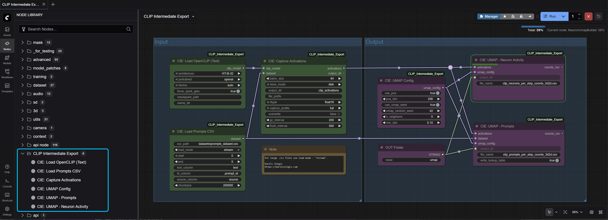

# Searching for Novelty in Latent Spaces:  A Design-Oriented Exploration

<iframe width="1920" height="1080"
src="https://www.youtube.com/embed/UKmWy38a-3c?si=NUlFcujFksuEONaY"
title="YouTube video player" frameborder="0"
allow="accelerometer; autoplay; clipboard-write; encrypted-media; gyroscope; picture-in-picture; web-share"
referrerpolicy="strict-origin-when-cross-origin"
allowfullscreen>
</iframe>

The question of whether neural networks can generate novelty, and how we might even begin to look for it, is very intriguing to me. There is one problem, though: I am not a machine learning expert. Because of that, I stepped back from CLIP for a moment — focusing on reducing complexity and finding a simpler analogy to work with.

Coming from a design background, color is easy to perceive, and in digital terms it consists of just three values. If we combine five colors into a palette, that gives us a fifteen-dimensional representation of that palette.

What makes color palettes especially useful is that they can be based on color harmony rules, which makes them a good starting point to explore how structure might appear in latent space.

I built a color palette generator in [Houdini](https://www.sidefx.com/products/houdini/), similar to the one available on [color.adobe.com](https://color.adobe.com). The difference is that in Houdini I can generate as many palettes as necessary and adjust parameters procedurally. After generating one thousand palettes per color harmony rule, I also scraped one thousand user-generated palettes from Adobe. In total - eight thousand palettes. This resulted in a reasonably good dataset to build my own model on.

Using the fast.ai library, as suggested by my professor, I trained a model based on a ResNet architecture. fast.ai automatically chooses the architecture depending on the situation, so I treated it as a baseline.

To test robustness, I duplicated all palettes into a second dataset where the order of colors inside each palette is randomized. The original order is defined by how the harmony rules and the script places the colors. Since for humans order of colors in a palette is not really that meaningful, I want to see how much influence this ordering has on the learned structure.

Based on this, I trained two separate models: one on the ordered dataset and one on the randomized dataset.

When comparing the results, some points clearly shift from one cluster to another. Since the inferred data is identical, these changes depend on the model rather than on the data itself.

When mapping the palettes into latent space, it is still clear that structure is influenced by color relationships and contrast. However, in the randomized dataset, individual color harmony rules are difficult to identify. Instead, three larger clusters appear, each containing multiple harmony types.

When looking only at user-generated palettes, most of them are concentrated in two of these clusters, while the third cluster contains very few. This suggests that the harmony rules represented in that cluster are generally less preferred by designers, which is unexpected.

What becomes especially clear is how large the difference is when inferring ordered datasets. When the same models are given ordered palettes, the results are much more structured. Color harmony rules are clearly separated and easier to distinguish in latent space.

This indicates that the order inside the palette embedding plays an important role during training and inference. The way data is structured influences how it is interpreted by the model. This is why, in CLIP, token embeddings must be transformed into a meaningful semantic context.

When inferring the ordered dataset using both models, the results are again surprisingly similar. Both produce clean and structured separations by harmony rule, although small differences remain. Interestingly, the model trained on randomized data sometimes produces better separation for specific rules.

When isolating only the user-generated palettes within the ordered latent space, it becomes much clearer which harmony rules and clusters they belong to, even though the classification is not one hundred percent correct. Overall, the ordered dataset produces a much less chaotic and more interpretable structure.

I used two different classification methods to determine which harmony rules the user palettes belong to. One method relies on the trained model itself and uses cosine distance to measure how close a palette is to the centroid of each harmony cluster. The second method uses a random forest classifier trained on all latent vectors, which produces more detailed results.

However, this classifier often struggles to clearly distinguish between shades and analogous palettes. When looking at the palettes mapped in UMAP space, this confusion makes sense. Many palettes classified as shades also contain analogous color variations, just lighter. This overlap is likely present in the training data itself, since most harmony rules include some degree of shading.

Instead of only looking at the final embeddings, I start to think more about how structure emerges through transformation. This line of thinking is also influenced by a video from the Smarter Every Day YouTube channel about Taylor–Couette flow. While neural networks do not operate according to fluid dynamics, the comparison works as a conceptual analogy.

It raises the question of whether representations emerge through transformations that resemble turbulent mixing, where information becomes irreversibly entangled, or whether they behave more like laminar flow, where trajectories can be followed and partially reconstructed.

After gaining more confidence with the palette project, I began examining CLIP by collecting information from its intermediate states in order to visualize them. Sometimes structure becomes clearer simply by looking at what is already there.
With the help of [CODEX](https://openai.com/codex/), I developed a [ComfyUI](https://www.comfy.org/) node workflow export these representations.

This is how I imagine the space warping and blending, when latent space takes shape. It is absolutely not correct in any way, but I wanted to see this concept. As token embeddings are sorted and organized, there is an underlying coordinate space which is encoded in each of the tokens. Maybe there is something to it.

After gaining more confidence with the palette project, I turned to CLIP and started collecting statistics from its intermediate representations and visualizing them. Sometimes structure becomes clearer simply by looking at it.

The idea was to explore how the space might warp and blend as latent structure forms. This is not technically accurate, but it helped guide the intuition. Token embeddings are mapped into a shared space and then transformed layer by layer. I wanted to see whether anything meaningful becomes visible when following these transformations.

Using a dataset of diverse text prompts gathered from freely available sources online, I constructed embedding and neuron activation UMAP visualizations across different layers of CLIP. This made it possible to track how the vectors shift throughout the forward pass — almost like a timeline of the latent taking shape.

I also exported neuron activation trees to visualize activation intensities across layers.

I did not find a reliable method to detect novelty or manifold directly. However, examining how structure changes across layers suggested that focusing on transformation dynamics may be more informative than looking only at final embeddings.
